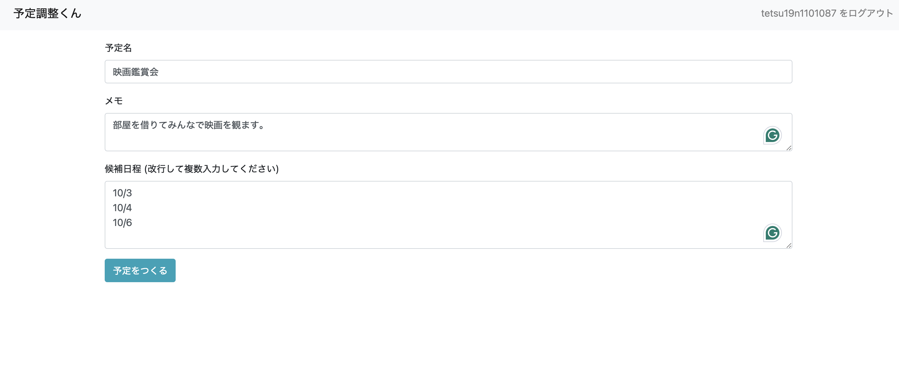
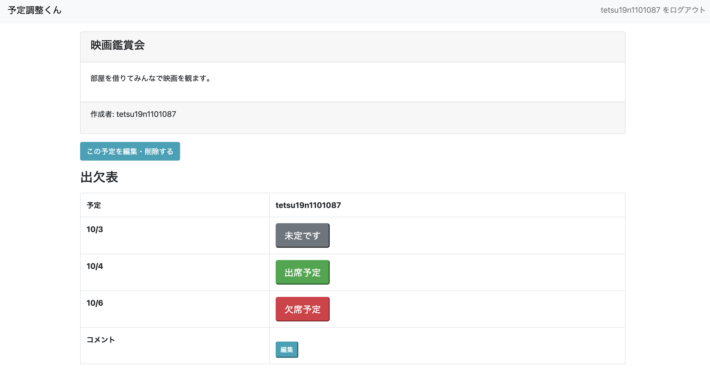

# 予定調整アプリ

スケジュールを調整し、できるだけ多くの人が参加できる適切な予定日時を決定するためのサービスです。
GitHubのアカウントでログインできます。

ホーム画面  

予定作成ページ  

出欠確認ページ  

[リンクはこちら](https://schedule-arranger-ch6e.onrender.com/)

## 使用技術
- Express.js
- Pug
- PostgreSQL
- AJAX (jQuery)

## 機能一覧
- スケジュール調整機能
  - 予定を作れる
  - 予定に候補が作れる
  - 予定の候補に対して出欠を編集できる
  - 予定に対してコメントが編集できる
  - 予定を削除できる
  - 予定を編集できる
- GitHubアカウントによるログイン機能